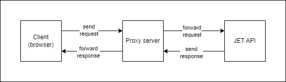

# Backend
This is the backend of the application. It is merely a proxy server that forwards the API calls from the frontend and routes the response back to the frontend.

This was necessary as the API does not support CORS, and the frontend would not be able to make the API calls directly from the browser.

If the API starts supporting CORS, the backend can be removed, and the frontend can make the API calls directly.