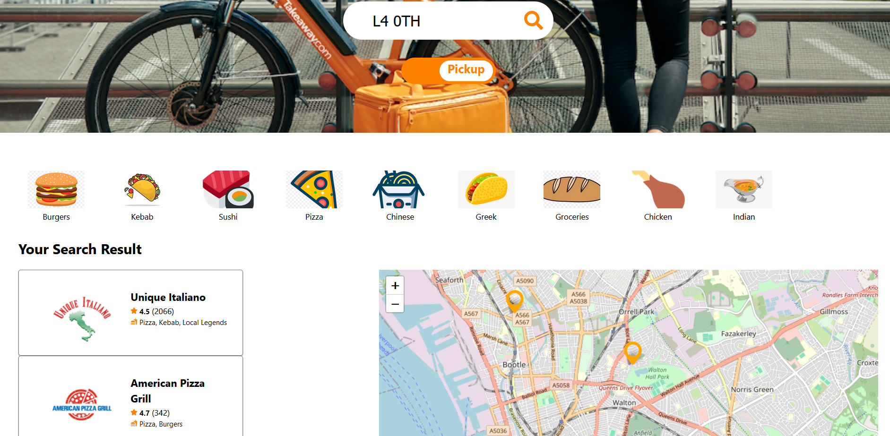

# Frontend
This is the frontend of the application.

## Available Scripts
In the project directory, you can run:

### `npm start`

Runs the app in the development mode and open [http://localhost:3000](http://localhost:3000) to view it in your browser.

### `npm test`

Launches the test runner in the interactive watch mode.

### `npm run build`

Builds the app for production to the `build` folder.

## Demo
Once the frontend server and the backend server are both running, open a web browser and go to [http://localhost:3000](http://localhost:3000) to view the application. Type in a valid UK postcode as the following:

Click on the search button or press enter to view restaurant results:

Click on any one of the cuisine type icons to filter the results:

Click on the toggle button to view restaurants for pickup (or delivery):

Click on one of the restaurant cards to see its location on the map:

Click on one of the markers to see the address of the restaurant:

If you type anything other than a valid UK postcode, you will see an error message:

